# Cache Coherence Across NUMA Nodes

---

## 1. Architecture Foundations

A **Non-Uniform Memory Access (NUMA)** system partitions a multi-socket machine into *nodes*. Each node owns a set of physical CPU cores, their private L1/L2 caches, a shared L3 (LLC) cache, and a directly-attached DRAM bank. Nodes are interconnected via a high-speed fabric — Intel's UPI (Ultra Path Interconnect), AMD's Infinity Fabric, or IBM's X-Bus depending on the vendor.

The term *non-uniform* refers to memory access latency: a core accessing its node's local DRAM pays the local latency (≈ 70–90 ns on modern Xeon), while a remote access crosses the interconnect and pays 1.5× to 3× that cost.

Below is the physical architecture of a 2-socket NUMA system:




---

## 2. Cache Coherence Protocols in NUMA Context

### 2.1 The Coherence Problem

Every CPU core operates on cache lines (typically 64 bytes). When multiple cores — potentially across sockets — hold copies of the same cache line and at least one writer exists, the hardware must ensure no core ever observes a stale value. This guarantee is *cache coherence*.

Within a single socket the L3 acts as a coherence point: it tracks the state of every line it holds (or evicts) and arbitrates between cores. Across sockets there is no shared LLC, so coherence must be maintained via message-passing over the interconnect.

### 2.2 The MESIF / MOESI State Machine

Modern x86 processors implement **MESIF** (Intel) or **MOESI** (AMD). Each cache line in every cache is in exactly one of these states:

| State | Meaning | Writeable | Shareable |
|---|---|---|---|
| **M** — Modified | Line is dirty; no other copy exists | Yes | No |
| **E** — Exclusive | Line is clean; sole owner | Yes (silently → M) | No |
| **S** — Shared | Clean; other caches may hold copies | No | Yes |
| **I** — Invalid | Line absent or stale | No | No |
| **F** — Forward (Intel) | Designated responder among S-holders | No | Yes |
| **O** — Owned (AMD) | Dirty but shared; owner must supply data | No | Yes |

The complexity explodes in NUMA because transitions now require *cross-node snoop messages* instead of intra-socket bus transactions.

### 2.3 Snoop Protocols

Hardware implements one of three cross-node strategies:

**Broadcast snooping** — on a write, the home node broadcasts an `Invalidate` to every remote socket. Simple but O(N) traffic; does not scale beyond 4–8 sockets.

**Directory-based coherence** — a *directory* (either embedded in the LLC or in a dedicated structure) tracks, per cache line, which nodes hold a copy. On a write, only those nodes receive the invalidation. This is the dominant approach in modern Xeon (SNOOP_BROADCAST vs. SNOOP_FILTER modes in the BIOS) and EPYC systems.

**Home-node / Caching Home Agent (CHA)** — Intel Xeon Scalable divides the LLC into slices, each managed by a CHA that owns a portion of the physical address space. The CHA is both the directory and the L3 arbiter. Remote reads hit the appropriate CHA, which either satisfies the request from its LLC slice or fetches from DRAM.

### 2.4 Cross-Node Read/Write Walk-through

Consider a cache line *A* initially resident in Node 0's L3 in state **M** (dirty, owned by Core 0). Core 1 on Node 1 now issues a read to *A*:

1. Node 1's CHA receives the load miss and determines via address hashing that *A*'s home is on Node 1 (or Node 0, depending on the physical address).
2. A `Snoop Read` message is sent over UPI/Infinity Fabric to Node 0.
3. Node 0's CHA detects that Core 0 holds *A* in state M. It issues a `Recall` to Core 0, which writes back the dirty data and transitions to **I** or **S**.
4. Node 0's CHA forwards the data to Node 1 and updates the directory.
5. Node 1's Core 1 receives the line in state **S** (or **F** if Intel Forward is used).

The entire round-trip adds 40–80 ns on top of a normal cache-miss latency. If the subsequent access is a *write*, an additional `Invalidate` round-trip is required. **Two full interconnect crossings per conflicted write** is the baseline tax.

---

## 3. Performance Impact on Multithreaded Applications

### 3.1 False Sharing

The most insidious NUMA coherence pathology is *false sharing*: two threads on different nodes write to distinct variables that happen to reside on the same 64-byte cache line. The hardware cannot distinguish byte-level ownership — the entire line toggles between M states on both nodes at interconnect speed.

```cpp
// Pathological: counter[0] and counter[1] share a cache line
struct alignas(8) Counters { std::atomic<int64_t> cnt[2]; };
Counters g;

// Thread on Node 0 hammers cnt[0], Node 1 hammers cnt[1]
// -> perpetual cross-node invalidation storm
```

Measured throughput collapse from false sharing on a 2-socket system can be **5× to 20×** compared to the non-shared baseline.

### 3.2 True Sharing — Producer/Consumer Patterns

Even correct sharing, where one thread legitimately writes data the other reads, pays the coherence tax. A lock-free SPSC queue with head on Node 0 and tail on Node 1 generates a cross-node snoop on every enqueue/dequeue pair. At 10M operations/s, that is 10M × 80 ns = 800 ms/s of stall budget consumed purely in interconnect latency.

### 3.3 Remote Memory Allocation (NUMA Imbalance)

The Linux kernel's default first-touch policy allocates physical pages on the node of the thread that first writes them. If a thread on Node 0 initializes a large buffer and then a thread on Node 1 streams through it, *every* cache miss crosses the interconnect. At DRAM bandwidth of 200 GB/s per node, the remote penalty effectively halves achievable bandwidth for the remote node's threads.

### 3.4 Lock Contention and Coherence Amplification

A `std::mutex` implementation uses an atomic compare-and-swap on a single memory word. Under contention from threads on both nodes, that word ping-pongs between nodes in M state, serializing not only at the application level (logical serialization) but also at the hardware level (physical coherence traffic). The result: lock acquisition cost grows from ~20 ns (uncontested) to 200–400 ns (cross-node contested).

### 3.5 Directory Saturation

With many-core NUMA systems (e.g., 2×60-core Xeon Platinum), a hot shared variable can saturate the CHA responsible for its address. The CHA is a finite resource: it handles a bounded number of outstanding snoop transactions. A thread storm targeting the same few cache lines creates *CHA back-pressure*, stalling the entire interconnect ring for that address range.

### 3.6 Quantitative Summary

| Access type | Typical latency | Notes |
|---|---|---|
| L1 hit | 4–5 cycles (1–2 ns) | Private to core |
| L2 hit | 12–14 cycles (4 ns) | Private to core |
| L3 hit (local) | 40–50 cycles (13–17 ns) | Shared within socket |
| Local DRAM | 200–300 cycles (70–90 ns) | Intra-node |
| Remote DRAM | 400–700 cycles (140–220 ns) | Cross-node, no contention |
| Cross-node M→S snoop | +100–250 cycles extra | Contested dirty line |
| Cross-node false sharing loop | Effectively serialized | Repeating M↔I transitions |

---

## 4. Optimization Techniques

### 4.1 NUMA-Aware Memory Allocation

Use `libnuma` (Linux) or `VirtualAllocExNuma` (Windows) to allocate memory on the node that will own it:

```cpp
#include <numa.h>

// Allocate 1 GB pinned to NUMA node 1
void* buf = numa_alloc_onnode(1UL << 30, /*node=*/1);

// Or use interleaved policy for arrays accessed by all nodes uniformly
numa_set_interleave_mask(numa_all_nodes_ptr);
void* shared = numa_alloc_interleaved(size);
```

For C++ allocators, wrap `numa_alloc_onnode`/`numa_free` in a custom `std::pmr::memory_resource` so STL containers respect NUMA topology automatically.

### 4.2 Thread-to-Core Affinity

Pin threads to cores on the same NUMA node as their working data:

```cpp
#include <pthread.h>
#include <sched.h>

void pin_thread_to_node(int numa_node) {
    cpu_set_t cpuset;
    CPU_ZERO(&cpuset);

    // Query which CPUs belong to this NUMA node via libnuma
    struct bitmask* cpus = numa_allocate_cpumask();
    numa_node_to_cpus(numa_node, cpus);

    for (int i = 0; i < numa_num_configured_cpus(); ++i)
        if (numa_bitmask_isbitset(cpus, i))
            CPU_SET(i, &cpuset);

    pthread_setaffinity_np(pthread_self(), sizeof(cpuset), &cpuset);
    numa_free_cpumask(cpus);
}
```

With `std::thread`, wrap the above in the thread's entry function before doing any allocation, so that the first-touch policy places pages locally.

### 4.3 Eliminating False Sharing via Cache-Line Padding

```cpp
// Correct: each counter occupies its own 64-byte line
struct alignas(64) PaddedCounter {
    std::atomic<int64_t> value;
    char padding[64 - sizeof(std::atomic<int64_t>)];
};

static_assert(sizeof(PaddedCounter) == 64);
static_assert(alignof(PaddedCounter) == 64);

// Thread-local aggregation with periodic global flush (even better)
thread_local int64_t local_cnt = 0;
PaddedCounter global_cnt;

void increment() {
    if (++local_cnt >= 1024) {
        global_cnt.value.fetch_add(local_cnt, std::memory_order_relaxed);
        local_cnt = 0;
    }
}
```

C++17's `std::hardware_destructive_interference_size` (typically 64 on x86) is the standard-conformant constant to use instead of the magic number 64.

### 4.4 Per-Node Data Structures

Avoid a single shared queue. Instead use per-NUMA-node queues and a work-stealing scheme that first drains local queues before crossing sockets:

```cpp
struct alignas(64) NodeQueue {
    std::deque<Task> tasks;
    std::mutex       mtx;
    int              node_id;
};

// One queue per NUMA node
std::vector<NodeQueue> queues(numa_num_configured_nodes());

Task steal_work(int my_node) {
    // Try local first
    if (auto t = try_pop(queues[my_node])) return *t;
    // Only cross socket when local is empty
    for (int n = 0; n < queues.size(); ++n)
        if (n != my_node)
            if (auto t = try_pop(queues[n])) return *t;
    return {};
}
```

### 4.5 Read-Copy-Update (RCU) for Read-Heavy Workloads

Shared read-mostly data (configuration tables, routing entries) can be accessed by all nodes without coherence traffic if it is never written during normal operation. The RCU pattern maintains a pointer to an immutable snapshot:

```cpp
#include <atomic>
#include <memory>

std::atomic<std::shared_ptr<Config>> g_config;

// Readers: zero coherence traffic (S-state, no invalidations)
void reader() {
    auto cfg = std::atomic_load_explicit(&g_config, std::memory_order_acquire);
    use(*cfg); // cfg is immutable
}

// Writer: allocates a new copy, installs it atomically
void writer(Config updated) {
    auto next = std::make_shared<Config>(std::move(updated));
    std::atomic_store_explicit(&g_config, next, std::memory_order_release);
    // Old copy destroyed when last reader's shared_ptr expires
}
```

Because readers only load a shared pointer (transitioning the line to S, not M), the line can reside in every node's LLC simultaneously at full local-hit speed.

### 4.6 Partitioned / Sharded Global State

Any global structure accessed by all threads (a hash map, a memory pool, a statistics counter) becomes a serialization point under NUMA. Shard it by node:

```cpp
template<typename T>
struct NumaSharded {
    struct alignas(64) Shard { T value; };
    std::vector<Shard> shards;

    NumaSharded() : shards(numa_num_configured_nodes()) {}

    T& local() {
        return shards[numa_node_of_cpu(sched_getcpu())].value;
    }

    // Aggregate (rarely, e.g. for reporting)
    T aggregate() const {
        T result{};
        for (auto& s : shards) result += s.value;
        return result;
    }
};

NumaSharded<std::atomic<int64_t>> hit_counter;
```

### 4.7 First-Touch and `madvise` / `mbind`

When you cannot use `numa_alloc_onnode`, control page placement after allocation:

```cpp
#include <sys/mman.h>
#include <numaif.h>

// Rebind an existing mapping to node 0
unsigned long nodemask = 1UL << 0;
mbind(ptr, size, MPOL_BIND, &nodemask, sizeof(nodemask)*8, MPOL_MF_MOVE);

// Or use MPOL_INTERLEAVE to stripe pages across nodes
// (best for large arrays accessed by all threads equally)
unsigned long all_nodes = (1UL << numa_num_configured_nodes()) - 1;
mbind(ptr, size, MPOL_INTERLEAVE, &all_nodes, sizeof(all_nodes)*8, 0);
```

`MPOL_MF_MOVE` instructs the kernel to physically migrate existing pages — expensive but correct when a thread migrates to a new node.

### 4.8 Hardware Prefetch and Software Prefetch Across Nodes

Cross-node prefetches amortize latency if issued far enough in advance. The x86 `prefetchnta` (non-temporal) hint fetches into L1 while bypassing L2/L3, reducing pollution of the local LLC:

```cpp
void process_remote_array(const float* arr, size_t n) {
    constexpr int PREFETCH_DIST = 32; // cache lines ahead
    for (size_t i = 0; i < n; ++i) {
        if (i + PREFETCH_DIST < n)
            __builtin_prefetch(&arr[i + PREFETCH_DIST], 0, 0); // NTA hint
        compute(arr[i]);
    }
}
```

The prefetch distance must be tuned to be at least `remote_latency / compute_time_per_element` lines. Too small and it does not hide the latency; too large and it pollutes the TLB and cache prematurely.

### 4.9 NUMA-Transparent Huge Pages (THP) and `madvise(MADV_HUGEPAGE)`

2 MB huge pages reduce TLB pressure substantially on NUMA workloads. With 4 KB pages, a 1 GB working set needs 262 144 TLB entries; with 2 MB pages that falls to 512. TLB misses on remote nodes pay the full interconnect latency for the page-table walk itself — huge pages cut this overhead sharply:

```cpp
madvise(ptr, size, MADV_HUGEPAGE);  // request THP promotion
```

Alternatively, use `MAP_HUGETLB | MAP_HUGE_2MB` at `mmap` time. Combine with `mbind` so huge pages are allocated on the correct node.

### 4.10 Profiling Tools

Optimization without measurement is premature. The following toolchain targets NUMA coherence pathologies specifically:

| Tool | What it measures |
|---|---|
| `perf stat -e offcore_response` | Cross-socket demand reads, LLC misses hitting remote DRAM |
| Intel VTune Amplifier — Memory Access | NUMA distance, remote DRAM bandwidth, snoop traffic per CHA |
| `numactl --hardware` | Physical topology, distance matrix |
| `numastat -p <pid>` | Per-node allocation/hit rates for a running process |
| `perf c2c` | Cache-to-cache (false sharing) hot lines, with source-level attribution |

`perf c2c` in particular directly identifies false-sharing victims by reporting which source lines generate the most `HITM` (Hit-Modified) events — the hardware event that fires precisely when a load finds the target line in M state on a remote cache.

---

## 5. Architectural Trends Affecting the Landscape

**AMD EPYC's chiplet design** (multiple CCDs connected via Infinity Fabric) introduces *intra-socket* NUMA: two CCDs on the same socket have non-uniform latency between them, making NUMA topology effectively 4–8 "nodes" on a single processor. NUMA-unaware code suffers even within one physical socket.

**CXL (Compute Express Link) 3.0** enables memory pooling across nodes with coherence maintained at the CXL switch level, introducing a third tier of memory latency. Future multithreaded code will need to reason about local DRAM, remote DRAM, and pooled CXL memory as distinct coherence domains.

**ARM's CCIX and AMBA CHI** bring directory-based coherence to server-class ARM (e.g., AWS Graviton, Ampere Altra), with similar cross-node snoop cost structures as x86 — the optimization techniques above transfer directly, though the exact latency figures differ.

---

The core engineering discipline is: **data locality first, then thread locality**. Structure your data so it lives where the thread that owns it lives, minimize shared mutable state across nodes, and when cross-node sharing is unavoidable, make it read-only or batched. Every one of the techniques above is a specialization of this principle applied to a particular access pattern.

---

> [!NOTE]
> 
> Generated by Claude.ai
>
> Model: Sonet 4.6
>
> Prompt: Provide a thorough description of Cache Coherence Across NUMA Nodes. Evaluate the influence of Cache Coherence Across NUMA Nodes on the performance of multithreaded application. Provide the methods to increase the performance of the application. This description is intended for a computer science expert familiar with C++ language. 
