# Hight Frequency Trading Pipeline, Stage 4

Stage 4 is the most architecturally significant boundary in the entire HFT pipeline — the point at which the system transitions from passively observing the market to actively affecting it. Here's a deep breakdown across the three lenses you asked about.

---

## System architecture

The stage is built around a strict one-way membrane. On the left sits the signal engine: a stateless, read-only process that consumes the enriched order book and applies quantitative models to produce trading decisions. On the right sits the Order Management System (OMS): a stateful, side-effecting process that owns the firm's open positions, outstanding orders, and risk exposure. The two worlds communicate through a bounded queue — and that queue is load-bearing in ways that go far beyond simple decoupling.

The signal engine itself is typically a single-threaded hot loop. Keeping it single-threaded eliminates lock contention and makes latency deterministic. The models it runs range from simple microstructure signals (order flow imbalance, queue position estimation) to statistical arbitrage models and, increasingly, lightweight neural network inference — the emphasis on "lightweight" is key, because a model that takes 50 microseconds to infer is worse than a simpler model that takes 2.

When the model fires, it doesn't submit an order — it produces an **order intent record**, a structured message describing the desired action without yet committing to it. This is the architectural trick that makes the boundary clean. The intent crosses the queue, and only then does the OMS take ownership.

The OMS thread is the enforcer. Before any intent becomes a live order, it passes through a gauntlet of pre-trade risk checks: position limits, notional exposure caps, order rate limits, instrument-level restrictions, and fat-finger checks. This is why the queue is called the "last line of defense" — nothing reaches an exchange that hasn't cleared this checkpoint.

---

## Software development considerations

**Threading model.** The signal engine and OMS intentionally live on separate threads — or, in the most latency-sensitive deployments, separate physical cores with CPU pinning and NUMA-aware memory allocation. The queue between them must be a lock-free, single-producer single-consumer (SPSC) ring buffer. Any mutex here would introduce jitter measured in microseconds, which at HFT timescales is unacceptable.

**The order intent record.** This data structure deserves careful design. It must be small enough to fit in a cache line (64 bytes), carry all information the OMS needs without any pointer-chasing, and be trivially serializable for the audit log. The fields described — instrument, side, quantity, price, order type, time-in-force — are the minimum; in practice the record also carries a model ID, a timestamp of generation, and a sequence number for reconciliation.

**Pre-trade risk check latency.** The checks must themselves be extremely fast — ideally sub-microsecond — which means no database calls, no network lookups, and no dynamic memory allocation on the hot path. Position and exposure state is kept entirely in in-process memory, updated atomically as fills arrive from the exchange.

**The read-only / stateful contract.** Enforcing the boundary in code requires discipline. The signal engine must have no references to OMS state — it cannot read current positions or pending orders, because doing so would introduce both coupling and contention. This isn't just a performance constraint; it's a correctness constraint. A signal that adjusts its output based on current inventory has different semantics and must be modeled explicitly, not smuggled across the boundary.

**Observability.** Every intent that enters the queue and every risk check outcome — pass or reject — must be timestamped and logged to an append-only audit trail. Regulators require it; post-incident analysis demands it. The logging path must be asynchronous so it cannot stall the OMS thread.

---

## Business implications

**Capital commitment is irreversible in practice.** Once an order reaches the exchange, recall is best-effort — a cancel may arrive after a fill, and the fill wins. This is why the OMS's pre-trade checks are so consequential: there is no "undo". A bug that allows a malformed intent through the queue can result in a runaway position within milliseconds.

**The queue is a rate-limiting surface.** If the signal engine generates intents faster than the OMS can validate and route them, the queue backs up. In a healthy system the signal engine fires infrequently enough that the queue is nearly always empty. A queue that is consistently non-empty is a signal that either the model is misfiring or the risk checks are too slow — both are urgent operational problems.

**Risk limits define the firm's effective exposure surface.** The pre-trade limits encoded in the OMS are not just technical parameters; they are the operational expression of the firm's risk appetite. Position limits must be calibrated to account for worst-case adverse market moves, and they must be updated dynamically as market conditions change. A static limit set at system startup is a liability — volatility regimes shift, and the OMS needs to be able to receive updated limits from a risk management feed without a restart.

**Regulatory and audit requirements.** In most jurisdictions, every order submitted to an exchange must be traceable to a decision record. The order intent queue and its associated audit log are the evidentiary chain. Firms that operate without this chain expose themselves to regulatory censure independent of whether their trading itself was harmful.

**The asymmetry of failure modes.** A false negative (a valid trade that the risk check incorrectly rejects) costs the firm an alpha opportunity — painful but recoverable. A false positive (an invalid trade that slips through) can cost multiples more and attract regulatory scrutiny. This asymmetry means the risk checks should be tuned conservatively, with the understanding that the signal engine's edge comes from model quality, not from relaxed guardrails.

---

> [!NOTE]
> 
> Generated by Claude.ai
>
> Model: Sonet 4.6
>
> Prompt: Based on the following description, provide an in-depth overview of Stage 4 of the High Frequency Trading pipeline. Pay close attention to the key elements of the system architecture, software development, and the business implications of this stage.
> 
> =====
> 
> ### The Full Pipeline in Detail
> 
> **Stage 4 — Signal Engine to Order Management System (OMS)**
> 
> The signal (or "alpha") engine applies quantitative models to the book state — these range from simple microstructure signals (order flow imbalance, queue position estimation) to complex statistical arbitrage models and, increasingly, lightweight neural network inference. When the model generates a trading decision, it produces an **order intent** record describing the desired action (instrument, side, quantity, price, order type, time-in-force) and enqueues it for the OMS.
> 
> This boundary deserves particular architectural attention because it is the boundary between the **read-only analytical world** and the **stateful, side-effecting world** of order management. Once an intent crosses this queue, it will eventually result in messages being sent to an exchange. The OMS thread therefore also serves as the enforcer of pre-trade risk limits, making this queue effectively the **last line of defense** before capital is committed.
