# Hight Frequency Trading Pipeline, Stage 8

Stage 8 is where the HFT pipeline keeps an exhaustive audit trail without paying the latency tax that logging normally carries. The core challenge is that every microsecond of delay on the critical path has a direct cost, yet regulatory requirements and debugging needs demand complete observability. The solution decouples the *act of recording* from the *work of formatting and writing*, using a lock-free asynchronous architecture.

Here is a structural overview of how the system fits together:

---

## System architecture

**The producer side — application threads**

Every thread in the pipeline acts as a producer. Rather than calling any traditional logging function, it writes a small, fixed-schema binary record directly into its own dedicated single-producer single-consumer (SPSC) ring buffer. That record contains three things: a hardware timestamp from the `RDTSC` instruction (nanosecond-resolution, zero syscall overhead), a numeric message identifier, and a small set of raw integer or floating-point fields. Critically, *no string is constructed at this point*. There is no `sprintf`, no heap allocation, and no lock acquisition. The write is a handful of cache-line-aligned stores — typically under 10 nanoseconds.

**The SPSC queue — the lock-free boundary**

Each thread owns exactly one SPSC queue. Because there is one producer and one consumer by design, the queue can be implemented entirely with relaxed atomics and memory fences, with no mutex and no CAS retry loop. The producer's write path is provably *wait-free*: it completes in a bounded number of instructions regardless of what any other thread is doing. This is the key guarantee that separates this architecture from conventional logging — the application thread is never subject to priority inversion, OS scheduler jitter, or contention from another logging caller.

**The consumer side — the I/O thread**

A single dedicated I/O thread spins across all per-thread queues, draining records as they arrive. Only here does the expensive work happen: message ID lookup, string formatting, timestamp conversion from TSC ticks to wall-clock time, and final serialisation to a file descriptor or a network socket. Because this work happens entirely off the critical path, its latency profile is irrelevant to trading performance. A formatting spike of 50 microseconds costs nothing to order flow.

---

## Software development considerations

**Choosing a queue implementation**

The ring buffer must be sized as a power of two so that the modulo operation reducing head/tail indices becomes a cheap bitwise AND. The buffer must be allocated on huge pages (2 MB) and pinned to avoid TLB misses during high-throughput bursts. Both the producer and consumer cache lines must be padded to 64 bytes to prevent false sharing — a subtle but punishing source of latency if overlooked.

**Clock discipline**

Using `RDTSC` directly is correct for ordering and duration measurement within a single socket, but requires a one-time calibration against `CLOCK_REALTIME` to convert ticks to wall-clock nanoseconds for the log output. On multi-socket machines, `RDTSCP` must be used in tandem with a check of the processor ID to detect cross-socket timestamp skew.

**Reference implementations**

Two mature libraries implement this pattern. **NanoLog** (Stanford) goes further than most: it pre-processes format strings at compile time, stores only the format ID and raw arguments at runtime, and reconstructs the full log string entirely offline via a post-processing tool. This pushes the per-log overhead below 10 ns. **spdlog** in async mode is more conventional — it uses a shared lock-free queue between all threads, which trades some contention for simpler integration. For the most latency-sensitive threads, a per-thread SPSC variant is always preferable to a shared queue.

**Backpressure handling**

One engineering question that demands an explicit policy decision is what the producer thread should do when its SPSC queue is full. The options are: drop the record silently, overwrite the oldest record, or spin-wait. In an HFT context, spinning is almost never acceptable on the critical path, so most implementations either drop with a drop counter (visible in metrics) or size the queue generously enough — typically millions of slots — that overflow is operationally impossible during normal operation.

---

## Business implications

**Regulatory compliance without compromise**

Regulators in most jurisdictions (MiFID II in Europe, SEC/FINRA in the US) require that firms maintain complete, timestamped audit trails of every order event with sub-millisecond precision. Stage 8 makes this compliance obligation cheap: because the async logger captures every event on every thread with hardware-precision timestamps, the firm can produce a legally defensible audit log without having introduced any measurable latency into the trading flow.

**Post-trade analysis and debugging**

When a strategy misbehaves — an unexpected position, a missed fill, a risk limit breach — the log records from Stage 8 are the primary debugging instrument. Because every thread logs without exception, engineers can reconstruct the exact causal sequence of events across all threads with nanosecond resolution. This dramatically compresses mean time to root cause, which translates directly into reduced downtime and avoided trading losses.

**Operational risk**

The architecture also provides a graceful degradation story. If the I/O thread falls behind (disk contention, network hiccup), the SPSC queues absorb the backlog without disturbing the trading threads. The system continues to function correctly; the only consequence is that log output is delayed, not that order latency increases. This decoupling between observability and performance is the defining business value of the Stage 8 design.

---

> [!NOTE]
> 
> Generated by Claude.ai
>
> Model: Sonet 4.6
>
> Prompt: Based on the following description, provide an in-depth overview of Stage 8 of the High Frequency Trading pipeline. Pay close attention to the key elements of the system architecture, software development, and the business implications of this stage.
> 
> =====
> 
> ### The Full Pipeline in Detail
> 
> **Stage 8 — Per-Thread Logging**
> 
> Every thread in the pipeline — without exception — writes diagnostic and audit logs. In conventional systems, logging is a notorious source of latency spikes: `printf`-style logging involves heap allocation, string formatting, and file I/O, any of which can block for microseconds. The solution is a **lock-free async logger** built on a per-thread SPSC queue.
> 
> The application thread (producer) writes a compact, pre-structured log record into the queue — typically containing a timestamp (from `RDTSC`), a message ID, and a few raw numeric fields. No string formatting occurs on the critical path. A dedicated I/O thread (consumer) drains the queue, performs the formatting and string interpolation offline, and flushes to disk or a network log sink. Projects like **NanoLog** and the async mode of **spdlog** implement this pattern. The SPSC queue guarantees that the logging thread never blocks the application thread, and the application thread's writes are always wait-free.
