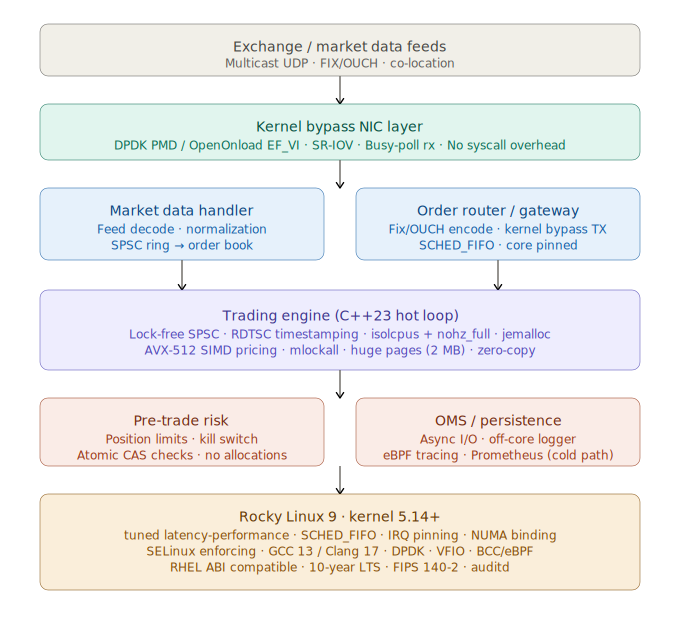

# Rocky Linux for High-Frequency Trading Systems

---

## 1. Why Rocky Linux as the Deployment Platform

Rocky Linux is a community-driven, RHEL (Red Hat Enterprise Linux)-compatible distribution designed as a drop-in replacement for CentOS after its shift to CentOS Stream. For HFT, this lineage matters deeply: RHEL-based kernels are hardened, long-lived, and extensively validated in enterprise financial environments. Rocky Linux 8/9 ships with kernel 4.18+ and 5.14+, respectively — versions that include critical subsystems needed for low-latency C++ workloads.

---

## 2. Kernel-Level Tuning for Ultra-Low Latency

An HFT system lives or dies by **tail latency** (P99.9, P99.99). Rocky Linux exposes the full RHEL tuning stack:

### CPU Isolation & NUMA Topology
```bash
# Isolate cores 2–15 from the OS scheduler (kernel boot param)
GRUB_CMDLINE_LINUX="isolcpus=2-15 nohz_full=2-15 rcu_nocbs=2-15"

# Pin trading threads to isolated cores using taskset or numactl
numactl --cpunodebind=0 --membind=0 ./hft_engine
```
- `isolcpus` removes cores from the general scheduler, eliminating OS jitter.
- `nohz_full` disables the periodic tick on isolated cores (tickless kernel), removing ~1–4 µs of timer interrupt noise.
- `rcu_nocbs` offloads RCU callbacks from hot cores.

### IRQ Affinity
```bash
# Move all IRQs away from trading cores
for irq in /proc/irq/*/smp_affinity; do echo 1 > $irq; done  # core 0 only
# Pin NIC IRQs to specific cores for RSS (Receive Side Scaling)
echo 4 > /proc/irq/$(cat /sys/class/net/eth0/device/msi_irqs/*)/smp_affinity
```

### Huge Pages & Memory Locking
```bash
echo 1024 > /proc/sys/vm/nr_hugepages   # 2MB huge pages
# In C++:
mmap(nullptr, size, PROT_READ|PROT_WRITE,
     MAP_PRIVATE|MAP_ANONYMOUS|MAP_HUGETLB, -1, 0);
mlockall(MCL_CURRENT | MCL_FUTURE);  // Prevent page faults mid-trade
```

---

## 3. C++ Toolchain Configuration on Rocky Linux

### Compiler & Optimization Flags
Rocky Linux 9 ships GCC 11 and supports LLVM/Clang via the AppStream or SCL repositories:

```bash
dnf install gcc-toolset-13   # GCC 13 via Software Collections
scl enable gcc-toolset-13 bash
```

Critical compiler flags for HFT:
```makefile
CXXFLAGS = -std=c++23 \
           -O3 \
           -march=native \          # Use AVX-512 / AVX2 SIMD intrinsics
           -flto \                  # Link-Time Optimization
           -fno-exceptions \        # Eliminate exception overhead
           -fno-rtti \              # No runtime type info
           -funroll-loops \
           -ffast-math \            # Relaxed IEEE 754 (verify semantics!)
           -DNDEBUG
```

### Memory Allocators
The default `glibc` allocator is unsuitable due to lock contention and fragmentation. Typical replacements:

```cpp
// jemalloc — used by many trading firms
// Link: -ljemalloc
// tcmalloc (Google) — excellent for thread-local caching
// Link: -ltcmalloc_minimal
// mimalloc (Microsoft) — modern, segment-based
```

### Lock-Free Data Structures
```cpp
// SPSC ring buffer — the backbone of inter-thread market data passing
template<typename T, size_t N>
class alignas(64) SPSCQueue {
    alignas(64) std::atomic<size_t> head_{0};
    alignas(64) std::atomic<size_t> tail_{0};
    T buffer_[N];
public:
    bool push(T&& val) noexcept {
        const size_t h = head_.load(std::memory_order_relaxed);
        if ((h - tail_.load(std::memory_order_acquire)) == N) return false;
        buffer_[h % N] = std::move(val);
        head_.store(h + 1, std::memory_order_release);
        return true;
    }
};
```

---

## 4. Networking Stack: The Critical Path

### Kernel Bypass with DPDK / RDMA
Standard socket I/O through the Linux network stack adds 10–50 µs of latency. HFT deployments on Rocky Linux bypass it entirely:

```bash
# Install DPDK
dnf install dpdk dpdk-devel
# Bind NIC to DPDK PMD (Poll Mode Driver)
dpdk-devbind.py --bind=vfio-pci 0000:01:00.0
```

```cpp
// DPDK polling loop — busy-poll, no interrupts
while (running_) {
    uint16_t nb_rx = rte_eth_rx_burst(port_id_, 0, mbufs_, BURST_SIZE);
    for (uint16_t i = 0; i < nb_rx; ++i)
        process_packet(mbufs_[i]);
}
```

**Solarflare / Xilinx OpenOnload** (EF_VI API) is another popular Rocky Linux-compatible kernel bypass used in production HFT:
```cpp
ef_vi vi;
ef_vi_receive_post(&vi, addr, id);
ef_event events[MAX_EVENTS];
int n = ef_eventq_poll(&vi, events, MAX_EVENTS);
```

### Network Tuning via `tuned`
Rocky Linux ships with `tuned`, the system tuning daemon:
```bash
tuned-adm profile latency-performance   # Disables C-states, P-states
# Or use network-latency for NIC-focused tuning
tuned-adm profile network-latency
```

Additional sysctls:
```bash
sysctl -w net.core.rmem_max=134217728
sysctl -w net.core.busy_poll=50          # Socket busy polling (µs)
sysctl -w net.ipv4.tcp_low_latency=1
sysctl -w kernel.numa_balancing=0        # Disable NUMA auto-balancing
sysctl -w kernel.sched_rt_runtime_us=-1 # Unlimited RT scheduling
```

---

## 5. Real-Time Scheduling & Thread Prioritization

```cpp
// Set SCHED_FIFO for the hot trading thread
struct sched_param param{};
param.sched_priority = 99;
pthread_setschedparam(pthread_self(), SCHED_FIFO, &param);

// Set CPU affinity
cpu_set_t cpuset;
CPU_ZERO(&cpuset);
CPU_SET(4, &cpuset);  // Isolated core 4
pthread_setaffinity_np(pthread_self(), sizeof(cpu_set_t), &cpuset);
```

SELinux (enforced by default on Rocky Linux) must be carefully configured — not disabled — to allow `CAP_SYS_NICE` and `CAP_NET_ADMIN` for DPDK and RT scheduling without opening security holes.

---

## 6. Observability Without Jitter

Traditional profiling tools (perf, strace) introduce latency. Rocky Linux supports:

- **eBPF / BCC**: Kernel-level tracing with near-zero overhead
  ```bash
  dnf install bcc-tools bpftrace
  bpftrace -e 'tracepoint:sched:sched_switch { @[comm] = count(); }'
  ```
- **RDTSC-based timestamping** in C++ for sub-nanosecond internal profiling:
  ```cpp
  inline uint64_t rdtsc() noexcept {
      uint32_t lo, hi;
      __asm__ volatile("rdtsc" : "=a"(lo), "=d"(hi));
      return (uint64_t)hi << 32 | lo;
  }
  ```
- **Prometheus + node_exporter**: For out-of-band system metrics not on the hot path.

---

## 7. Deployment Architecture Overview



---

## 8. Pros & Cons of Rocky Linux for HFT

---

### ✅ Pros

**RHEL ABI Stability & LTS Lifecycle.** Rocky Linux tracks RHEL binary compatibility with a 10-year support window. This is decisive for HFT: you compile your C++ codebase once, validate it exhaustively, and don't touch the OS for years. ABI churn — the bane of rolling-release distros — is eliminated. Kernel updates are backport-only (security patches, not feature regressions), so your tuned CPU isolation and IRQ affinity configurations remain valid.

**Mature Kernel Tuning Ecosystem.** The RHEL lineage includes `tuned`, a first-class, profile-driven system tuner with `latency-performance` and `realtime` profiles that configure C-states, P-states, IRQ balancing, CPU governor, and THP in a single command. This is far more integrated than on Debian-based distros where equivalent tuning requires manual sysctl/udev orchestration.

**Enterprise-Grade Security Without Performance Sacrifice.** SELinux (mandatory access control) is enforced by default, providing process isolation between the trading engine and ancillary services without the overhead of full VM-level isolation. With proper policy writing, you grant `CAP_SYS_NICE`, `CAP_NET_ADMIN`, and VFIO device access surgically — no privilege escalation surface. This is critical for regulated trading environments requiring MiFID II/Reg NMS audit trails (`auditd` is a native RHEL component).

**Toolchain Depth.** GCC Toolsets (SCL) provide GCC 12/13 alongside the system compiler without conflicting library paths, enabling `march=native`, LTO, and PGO. LLVM/Clang is available via EPEL/AppStream. The `perf` tooling, BCC, and `bpftrace` all track upstream closely. DPDK and RDMA-core packages are maintained in EPEL, saving you from building from source on every deploy.

**NUMA & CPU Topology Support.** Rocky Linux inherits RHEL's `numactl`, `hwloc`, and `lstopo` toolchain, which are essential for pinning trading threads to NUMA nodes collocated with the NIC PCIe root complex — a topology that can shave 100–300 ns off memory-access latency on multi-socket servers.

**Financial Industry Precedent.** The majority of Tier-1 bank trading infrastructure runs on RHEL. Rocky Linux gives you an identical environment without the licensing cost (~$1,000–$3,500/server/year for RHEL), which matters when you're deploying dozens of co-location nodes. The familiar environment also means your sysadmin team, vendor support contacts, and compliance tools (Qualys, Tenable, etc.) all "just work."

---

### ❌ Cons

**Kernel Version Lag.** Rocky Linux 9's kernel (5.14.x backport series) is significantly behind upstream. Several low-latency improvements landed in 5.15–6.x: improved `SCHED_EXT` (extensible scheduler), better `io_uring` batch processing, and more granular CPU isolation flags. You won't get these without a custom kernel build, which undermines the entire value proposition of a stable, certified OS base. Firms needing bleeding-edge scheduler features often run a custom `rt-patch`ed kernel anyway, making the base distro less relevant.

**No Real-Time Kernel Out of the Box.** Unlike RHCOS or dedicated RT distros (e.g., the RHEL-RT variant), Rocky Linux doesn't ship a `PREEMPT_RT`-patched kernel in its standard repositories. For the absolute lowest-jitter `SCHED_FIFO` execution (eliminating `CONFIG_PREEMPT` latency spikes in the 10–100 µs range), you need to either patch and compile your own kernel or use the separate `kernel-rt` package — the latter only available in the RHEL RT add-on subscription, not in the free Rocky ecosystem.

**DPDK Package Freshness.** DPDK in EPEL tends to lag upstream by 1–3 major versions. Given that DPDK adds new PMDs and performance-critical features every cycle (e.g., improved Intel E810/DSA support, AF_XDP PMD improvements), HFT shops almost universally maintain their own DPDK build. This makes the packaged version a false convenience — you'll maintain a custom build pipeline regardless.

**Conservative Compiler Defaults.** The system GCC and associated glibc are optimized for broad compatibility, not peak throughput. GCC Toolsets via SCL solve the compiler problem, but you're still linking against a conservative glibc. glibc's `malloc` and `pthread` mutex implementations are tuned for workload breadth, not HFT's pathological pattern of thousands of tiny, aligned allocations per second. A custom allocator (`jemalloc`, `tcmalloc`, `mimalloc`) is mandatory — this isn't a Rocky-specific problem, but the stock toolchain gives you no help here.

**Community Support Velocity.** Despite being RHEL-compatible, Rocky Linux's community is smaller than Debian/Ubuntu's. Novel kernel-bypass techniques, emerging DPDK PMD bugs, and cutting-edge eBPF patterns are documented far more extensively in the Ubuntu/Arch ecosystem. For HFT-specific kernel tuning questions, you will routinely find that StackExchange answers, blog posts, and vendor quickstart guides are Ubuntu-first.

**SELinux Operational Overhead.** While SELinux is a pro for security, it is a significant operational burden. Writing custom policies for DPDK's VFIO device access, RDMA `mlx5` verbs, and custom `mmap`/`mlock` patterns requires deep SELinux expertise. Misconfigured policies silently deny `mlock` calls, resulting in page faults on the hot path — the kind of intermittent latency spike that is agonizing to diagnose. The temptation (and common antipattern) is to set `setenforce 0`, which eliminates the security benefit entirely.

---

### Summary Verdict

| Dimension | Assessment |
|---|---|
| Stability / LTS | ✅ Best-in-class for production HFT |
| Kernel RT support | ⚠️ Requires separate `kernel-rt` or custom build |
| Networking / DPDK | ⚠️ Package lag; custom build recommended |
| Security posture | ✅ Strong; SELinux has steep ops cost |
| Toolchain | ✅ Good; SCL alleviates most gaps |
| Community / docs | ⚠️ Smaller than Ubuntu for bleeding-edge use |
| Cost vs RHEL | ✅ Zero licensing cost, identical ABI |

Rocky Linux is the correct choice for HFT when your primary concern is **production stability, auditability, and RHEL-compatible vendor certification** — the typical posture of Tier-1 and Tier-2 trading firms with compliance obligations. If your priority is **maximum kernel freshness and RT preemption**, a custom `PREEMPT_RT` kernel on top of Rocky (or a dedicated RHEL-RT subscription) is the pragmatic extension of this foundation.


---

> [!NOTE]
> 
> Generated by Claude.ai
>
> Model: Sonet 4.6
>
> Prompt: Provide a detailed explanation of the Rocky Linux application for deploying a high-frequency trading system implemented in C++. This description is intended for a computer science expert. Next, evaluate the pros and cons of using Rocky Linux for a high-frequency trading system.
