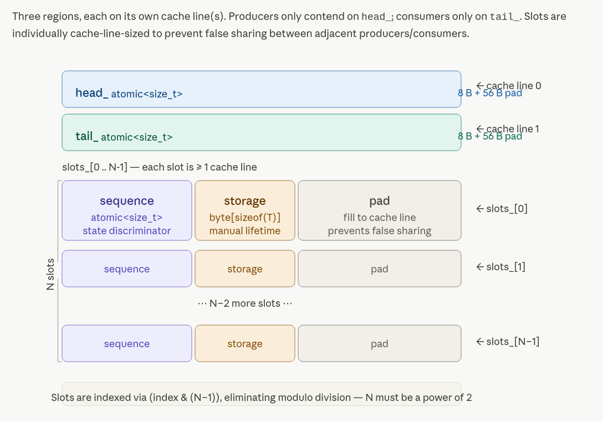
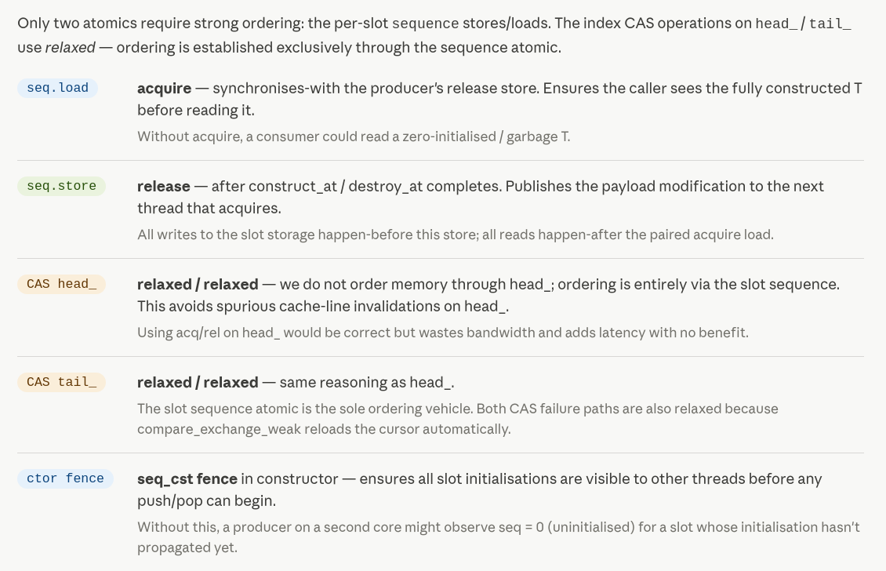
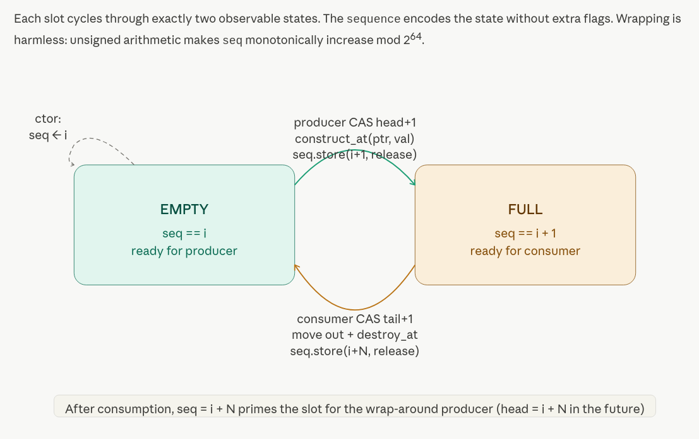
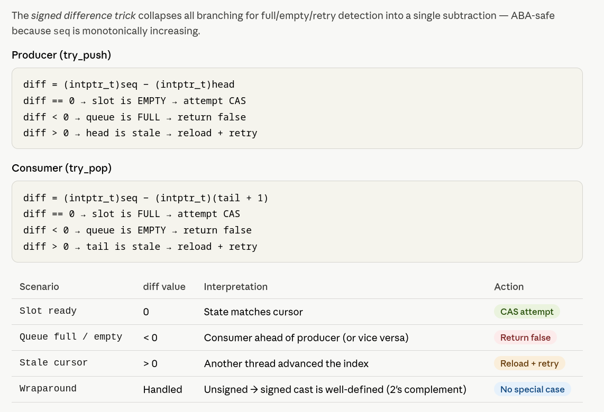

# Multiple Producer Multiple Consumer (MPMC) - Detailed Design Breakdown

---

## Core algorithm: Vyukov sequence-number MPMC

The fundamental mechanism is Dmitry Vyukov's insight that you can encode the *entire state of a slot* (empty, full, recycled) as a single atomic counter — the sequence number — without any extra flag bits, lock words, or reference counts.

Each slot holds a `sequence` and a raw byte buffer for the payload. The sequence's value relative to the current ring index tells every thread unambiguously what state the slot is in:

- `seq == head` — slot is empty, claimed by the *next* producer to CAS `head_`.
- `seq == head + 1` — slot is full, ready for the next consumer to CAS `tail_`.
- `seq == tail + Capacity` — slot has been consumed and is recycled for the producer that will arrive one full ring rotation later.

The construction that makes this work is the **signed-difference trick** (see the "Diff logic" tab). Rather than comparing `seq` against multiple possible expected values with branches, you compute `diff = (intptr_t)seq - (intptr_t)expected`. The sign of `diff` completely characterises the situation: zero means "go ahead and CAS", negative means "back-pressure — return false", positive means "stale cursor — reload and retry". This three-way branch is constant-time and handles unsigned wraparound after 2⁶³ operations without any special-casing, because signed subtraction of two's-complement values is well-defined under C++20.

---

## Memory layout and false-sharing strategy

Three physically separated regions exist in the object (see the "Memory layout" tab):

`head_` sits alone on cache line 0. Only producers write it. `tail_` sits alone on cache line 1. Only consumers write it. If they shared a line, every producer CAS would evict the consumer's hot data and vice versa — a cache-line ping-pong that can cost 200–400 ns per operation on modern NUMA systems, completely defeating the purpose of a lock-free structure.

Each slot is padded to fill at least one full cache line (`alignas(64)`). Without this, two producers racing on adjacent slots would share a line and trigger exactly the same ping-pong. For small `T` (a pointer, a 32-byte market event), the padding wastes space but the latency savings are not optional in HFT.

---

## Memory ordering — minimum viable, not conservative

The ordering discipline is precise and intentional (see the "Memory ordering" tab). The golden rule: *order memory through the sequence atomic, not through `head_` or `tail_`*.

The `sequence` acquire load (before claiming a slot) synchronises-with the `sequence` release store (after writing or consuming the slot). This single acquire/release pair establishes the happens-before edge that makes the payload visible. The CAS on `head_` and `tail_` uses `relaxed/relaxed` because it only needs to atomically advance the cursor — no payload ordering is needed from it. Using `acq/rel` on the CAS would be correct but wasteful: it would drain the store buffer unnecessarily and add 5–15 ns on x86 with no benefit.

---

## Spin discipline and the PAUSE instruction

The blocking `push` / `pop` use `_mm_pause()` (PAUSE on x86, YIELD on ARM) between retries. This is not a yield to the OS scheduler — it is a CPU hint. PAUSE serves two purposes. First, it prevents the store-buffer speculation that causes a machine-clear penalty when the spin loop repeatedly reads a cache line that another core is about to write. Second, it signals to SMT/hyper-threading hardware that this logical core is spinning, allowing the sibling thread to steal pipeline resources. In HFT the goal is to keep the core warm and the OS out of the picture; a `std::this_thread::yield()` would introduce microsecond-scale OS scheduler latency jitter that is unacceptable.

---

## Key design choices and their trade-offs

**Power-of-2 capacity** is enforced by a C++20 concept (`std::has_single_bit`). This allows `index & kMask` instead of `index % Capacity`, replacing a multi-cycle division with a single AND. At millions of operations per second this matters. The cost is that you must over-provision by up to 2×.

**Manual lifetime management** via `std::construct_at` and `std::destroy_at` into a raw `alignas(T) std::byte[sizeof(T)]` buffer avoids default-constructing `T` into all `N` slots at startup. For large or complex `T` this can be a seconds-long pause. The slot starts genuinely uninitialised; construction happens exactly at push time.

**Non-copyable, non-movable** is not laziness — it is a correctness requirement. The object contains raw atomics and manually-managed storage whose addresses are captured (implicitly) in the index/pointer arithmetic. Moving it would silently invalidate everything.

**Batch operations** (`try_push_bulk` / `try_pop_bulk`) amortise per-item overhead. The current implementation is a simple loop. A more aggressive optimisation would reserve a contiguous range of slots with a single wide CAS on `head_` (claiming `head_` to `head_ + N` atomically), then write all slots in parallel without contention. This is left as a comment in the code because it complicates the sequence-number invariants considerably and is rarely the bottleneck for realistic HFT batch sizes.

**NUMA** is the primary unaddressed concern. A single `MPMCRingBuffer` will be allocated on whatever NUMA node its constructing thread resides on. Producers and consumers on remote nodes pay a 60–100 ns remote-memory penalty per access. The solution is to allocate with `numa_alloc_onnode` (Linux) and pin producer/consumer threads to the same physical socket — architecture-level decisions that sit above this data structure.

---

> [!NOTE]
> 
> Generated by Claude.ai
>
> Model: Sonet 4.6
>
> Prompt: Provide detailed design notes and an explanation of the trade-offs of the multiple-producer, multiple-consumer (MPMC) lock-free ring buffer implemented in C++ code for a high-frequency trading system. This description is intended for a computer science expert who wants to implement the structure in C++. Also, provide the full and complete C++20 implementation.
