# SPSC Lock-Free Ring Buffer for High-Frequency Trading

A Single-Producer/Single-Consumer (SPSC) lock-free ring buffer is one of the most precisely optimized data structures in systems programming. Its guarantees emerge not from explicit synchronization primitives (mutexes, semaphores), but from a careful exploitation of hardware memory models and cache topology. Here is a complete technical analysis.

---

## Structural anatomy

The core structure is a fixed-size circular array of slots, indexed by two monotonically increasing counters — `head` (owned by the producer) and `tail` (owned by the consumer). Capacity is invariably a power of two, enabling the slot index to be computed via bitwise AND: `slot = counter & (capacity - 1)`. This eliminates the modulo operation and its associated division latency on the hot path.

The two counters are the architectural heart of the design. The critical insight is that **each counter is exclusively written by exactly one thread**, which is what permits lock-freedom:

- The producer reads `tail` to detect fullness, and writes `head` after insertion.
- The consumer reads `head` to detect emptiness, and writes `tail` after extraction.

Neither thread ever writes the other's counter. This asymmetry makes all CAS (Compare-And-Swap) operations unnecessary — a defining property of SPSC over MPSC or MPMC queues.

---

## Cache line isolation and false sharing

The most critical micro-architectural concern is **false sharing**. If `head` and `tail` share a cache line (typically 64 bytes on x86 and ARM), every write by one thread invalidates the other thread's cache line via the MESI coherence protocol. This transforms a logically independent write into a cache ping-pong — a catastrophic latency source of 50–300 ns depending on NUMA topology.

The canonical mitigation is padding:

```cpp
struct alignas(64) SpscQueue {
    alignas(64) std::atomic<size_t> head_{0};
    alignas(64) std::atomic<size_t> tail_{0};
    std::array<T, Capacity> slots_;
};
```

`alignas(64)` forces each counter onto its own cache line. On production HFT systems, the slot array itself is also often aligned to a huge page boundary (2 MB) via `mmap(MAP_HUGETLB)` to eliminate TLB pressure — a separate but related latency source.

---

## Memory ordering: the precise semantics

This is where most engineers introduce subtle bugs. The required ordering is:

**Producer (enqueue):**
```cpp
void push(const T& val) {
    size_t h = head_.load(std::memory_order_relaxed);  // ①
    slots_[h & mask_] = val;                            // ②
    head_.store(h + 1, std::memory_order_release);      // ③
}
```

**Consumer (dequeue):**
```cpp
bool pop(T& val) {
    size_t t = tail_.load(std::memory_order_relaxed);   // ④
    size_t h = head_.load(std::memory_order_acquire);   // ⑤
    if (h == t) return false;
    val = slots_[t & mask_];                            // ⑥
    tail_.store(t + 1, std::memory_order_relaxed);      // ⑦
    return true;
}
```

The semantics are precise:

- **Step ①** — `relaxed` is valid because `head_` is only written by the producer itself; no other thread observes a race here.
- **Step ③** — `release` establishes a *happens-before* edge: all writes to `slots_[h & mask_]` (step ②) are visible to any thread that subsequently acquires `head_`.
- **Step ⑤** — `acquire` consumes the release from step ③. This is the synchronization point: it guarantees the consumer sees the completed slot write before reading the slot value in step ⑥.
- **Step ⑦** — `relaxed` is valid because `tail_` is only written by the consumer; no synchronization is needed for its own counter.

On x86, `acquire`/`release` map to zero-cost operations because TSO (Total Store Order) already provides release semantics on all stores and acquire semantics on all loads. The `memory_order` annotations matter enormously on ARM (which is a weaker model), where they compile to `dmb ish` barrier instructions — still far cheaper than a lock.

---

## Fullness check: avoiding the stale read trap

A subtlety often glossed over: the producer reads `tail_` to check fullness. This read can observe a stale (old) value of `tail_`, causing the producer to incorrectly believe the buffer is full when the consumer has in fact advanced. The correct resolution is a **cached tail** — the producer caches its last-observed `tail_` and only re-reads the atomic when the cached value indicates fullness:

```cpp
alignas(64) size_t cached_tail_{0}; // producer-local, not shared

void push(const T& val) {
    size_t h = head_.load(std::memory_order_relaxed);
    if (h - cached_tail_ == Capacity) {
        cached_tail_ = tail_.load(std::memory_order_acquire);
        if (h - cached_tail_ == Capacity) { /* truly full */ return; }
    }
    slots_[h & mask_] = val;
    head_.store(h + 1, std::memory_order_release);
}
```

This avoids unnecessary atomic reads of `tail_` on every push. In a hot loop where the buffer is rarely full, the atomic read is never executed — only a local register comparison occurs.

---

## Effect on latency and jitter

Here is where the design implications converge into real-world HFT performance characteristics.

**Deterministic latency:** The absence of mutex acquisition eliminates OS scheduler involvement entirely. No futex syscalls, no kernel-mode transitions, no priority inversions. The critical path is: one `relaxed` load (register read on x86), one store to the slot (L1 cache if warm), one `release` store (also L1, no cache miss if the line is already owned). End-to-end, this is in the range of **5–30 ns** on modern server CPUs with warm caches, compared to 500–2000 ns for mutex-based queues.

**Jitter reduction:** Jitter — the variance of per-operation latency — is where SPSC queues most dramatically outperform mutex queues. A mutex queue's tail latency is dominated by: lock contention (if the other thread holds the lock), OS preemption of the lock-holder, and kernel scheduling delays. All three sources are unbounded and non-deterministic. SPSC queues eliminate all three: no contention (by construction), no kernel mode, and no multi-threaded access to the same cache line. The p99.9 and p99.99 latencies collapse toward the p50. This is decisive in HFT where a 50 µs tail-latency event during a market event costs the opportunity.

**Cache behavior:** Because the producer exclusively owns the `head_` cache line and the consumer exclusively owns the `tail_` cache line, the MESI protocol keeps each line in the *Modified* state in the owning core's L1 cache indefinitely — assuming the two threads are pinned to separate cores. The slot array itself follows a streaming access pattern: the producer writes forward, the consumer reads forward. In a well-configured system with a deep queue and high throughput, the hardware prefetcher can eliminate cache misses on the slot array entirely, keeping the payload path at L1 latency (~4 cycles).

**NUMA sensitivity:** If the producer and consumer threads are on different NUMA nodes, all of the above guarantees degrade: every cache line transfer becomes a QPI/UPI interconnect traversal (60–100 ns). Production HFT systems always pin SPSC pairs to cores on the same socket, sharing an L3 cache. Some systems go further and pin to adjacent cores sharing an L2 (e.g., hyperthreading siblings or adjacent physical cores), keeping all traffic within the L2 hierarchy.

**Spin-wait vs. yield vs. sleep:** The consumer must handle an empty queue. Three strategies exist: busy-spin (lowest latency, highest CPU cost), `_mm_pause()` spin (reduces pipeline pressure by ~5–10 cycles per iteration, prevents mis-speculation), and `sched_yield()`/`nanosleep()` (releases the CPU, catastrophic for latency). HFT systems invariably use `_mm_pause()` spin loops, often with adaptive backoff: spin for N iterations, then briefly yield only if a configurable threshold is exceeded.

---

Here is a structural and data-flow diagram of the full implementation:



---

## Bounded capacity as a feature, not a limitation

In HFT, unbounded queues are an anti-pattern. A fixed-capacity buffer with back-pressure semantics forces the system designer to reason about worst-case throughput. If a producer overruns the consumer, the buffer fills and the producer blocks or drops — both outcomes are **explicit** and auditable. An unbounded queue under load grows until it induces GC pressure (in JVM-based systems) or OOM, and the latency spike arrives silently and non-deterministically. The bounded ring buffer converts a potential liveness failure into a detectable, measurable flow-control signal.

## Additional production hardening

Beyond the canonical design, HFT implementations typically layer in:

**Slot sequencing (Disruptor pattern):** Each slot carries an embedded sequence number. The producer writes `sequence = index`, the consumer validates it. This eliminates head/tail arithmetic entirely and makes the check branch-predictor friendly.

**Batch operations:** Rather than `push` / `pop` one item at a time, the producer claims a range `[h, h+N)` in a single `head_` update, writes all N slots, then publishes. The consumer drains in batches too. This amortizes the atomic store cost over N items, reducing the per-item overhead to a pure L1 write.

**Prefetch hints:** `__builtin_prefetch(&slots_[(h+1) & mask_], 1, 1)` inside the producer's push loop prefetches the *next* write slot into L1 while the current write executes. At sustained throughput, this hides the L1 fill latency almost entirely.

**Compiler barriers:** On some compilers, `std::atomic` acquire/release still permits instruction reordering outside the critical window. Explicit `std::atomic_signal_fence(std::memory_order_acq_rel)` or `asm volatile("" ::: "memory")` guard the slot write from being reordered around the head publication by an aggressive optimizer.

---

## Holistic latency model

In an HFT pipeline with two threads (market data decoder → order router), a well-tuned SPSC queue contributes roughly **8–20 ns** of round-trip overhead in steady state: one `release` store on the producer side, one `acquire` load on the consumer side, and the slot read — all hitting L1 cache. The tail latency (p99.99) stays within 2–3× of the median because the only non-deterministic element is an occasional L2 cache fill (~12 cycles) when the consumer falls behind by one cache line. Compare this to a `std::mutex`-protected `std::deque`, which exhibits p99.99 latencies of 5–50 µs — three orders of magnitude worse — due to OS scheduling variance alone.

The SPSC ring buffer is therefore not merely a performance optimization but a **latency contract**: it relocates the worst-case bound from OS-scheduler-determined to cache-hierarchy-determined, and the cache hierarchy is vastly more predictable and measurable.


---

> [!NOTE]
> 
> Generated by Claude.ai
>
> Model: Sonet 4.6
>
> Prompt: Provide a thorough description of the single-producer/single-consumer (SPSC) lock-free ring buffer implemented in C++ code for a high-frequency trading system. This description is intended for a computer science expert. Explain how this data structure affects latency and jitter.
