# Order book architecture in HFT systems

An order book is the central data structure of any exchange or trading system. It maintains a real-time, sorted list of all outstanding buy (bid) and sell (ask) orders for a given instrument, matches incoming aggressive orders against resting passive orders, and publishes market data updates with microsecond latency. In a high-frequency trading context, every design decision revolves around a single constraint: **time**. The matching engine budget is typically in the range of 50–500 ns per operation; the market data pipeline must publish updates within single-digit microseconds.

---

## L2 vs L3 order book modes

### L2 — price-aggregated book

L2 presents the market as a collection of **price levels**, where each level exposes only the aggregate quantity available at that price, without revealing how many individual orders make up that quantity or their identities.

A typical L2 snapshot for 5 levels looks like:

```
Bid side            Ask side
Price   Qty         Price   Qty
100.05  1200   |   100.06  800
100.04  3400   |   100.07  2100
100.03  5600   |   100.08  4300
100.02  8900   |   100.09  7200
100.01  12100  |   100.10  9800
```

The exchange sends incremental updates of the form `(side, price, new_aggregate_qty)`. L2 is what most market participants see. It is compact, easy to distribute at high frequency, and sufficient for most market-making and statistical arbitrage strategies.

### L3 — order-level book

L3 exposes the full queue at every price level: each individual resting order with its `order_id`, `side`, `price`, `quantity`, and `timestamp`. It reveals queue position, which is critical for order flow toxicity analysis, queue-priority strategies, and reconstruction of the true matching engine state.

An L3 update stream produces events of the form:
- `ADD(order_id, side, price, qty)`
- `MODIFY(order_id, new_qty)`
- `DELETE(order_id)`
- `EXECUTE(order_id, exec_qty, trade_price)`

Only a handful of venues (CME Globex via MDP 3.0, NASDAQ ITCH, BATS PITCH, ICE iMpact) distribute L3 feeds. The data volume is 5–50× higher than L2. L3 reconstruction requires a stateful, sequence-number-checked processor because a single missed message corrupts the entire book state.

The critical difference: **L2 is a projection of L3**. Any L3 engine can trivially derive an L2 view by aggregating quantities per price level, but not vice versa.

---

## Core C++ data structure design

The canonical design decomposes the book into four interconnected layers.

### 1. Price-level map — the spine

The primary sorted container maps price → `PriceLevel`. The key invariant: bids are traversed descending, asks ascending. The best bid is `bids.rbegin()`, the best ask is `asks.begin()`.

**Structure for the price-level map:**

```cpp
// Fixed-point price encoding avoids float equality bugs and hashing ambiguity.
// For equities: price * 10000 fits in int64_t; for FX: price * 1e8.
using Price = int64_t;

struct PriceLevel {
    Price   price;
    int64_t total_qty;       // aggregate quantity (L2 view)
    uint32_t order_count;    // number of resting orders
    // L3 only:
    boost::intrusive::list<Order, ...> orders;  // FIFO queue, intrusive (no heap)
};

// Bid side: max-heap semantics → std::map<Price, PriceLevel, std::greater<Price>>
// Ask side: min-heap semantics → std::map<Price, PriceLevel, std::less<Price>>
```

`std::map` gives O(log N) insertion and O(1) amortized best-level access. For typical liquid instruments, N (number of distinct price levels) is 10–200, so the tree is tiny and almost certainly hot in L1 cache. The red-black tree rebalancing cost is acceptable at that scale.

**Alternative: Flat array with a "top-of-book pointer"** for ultra-low latency. If tick size is fixed and price range is bounded (e.g., futures with a ±5% circuit breaker), a `std::array<PriceLevel, MAX_LEVELS>` indexed by `(price - base_price) / tick_size` gives O(1) insertion and O(1) best-level lookup with zero allocation and superb cache behavior. This is the CME/LMAX model.

### 2. Order pool and order index — the L3 layer

```cpp
struct alignas(64) Order {           // cache-line aligned
    int64_t  order_id;
    Price    price;
    int64_t  qty;
    int64_t  remaining_qty;
    uint64_t timestamp_ns;
    Side     side;
    // Intrusive linked-list pointers (no allocator involvement):
    boost::intrusive::list_member_hook<> queue_hook;
};

// Flat pre-allocated pool — eliminates malloc on the critical path entirely.
// Use a free-list or bump allocator over a static array.
struct OrderPool {
    static constexpr size_t CAPACITY = 1 << 20;   // 1M orders
    Order    storage[CAPACITY];
    uint32_t free_list[CAPACITY];
    uint32_t free_top = 0;

    Order* alloc() noexcept { return &storage[free_list[free_top++]]; }
    void   free(Order* o) noexcept { free_list[--free_top] = o - storage; }
};

// O(1) lookup by order_id:
// Robin Hood hash map or flat open-addressing table.
// absl::flat_hash_map<int64_t, Order*> order_index;
```

The key design choices:
- **Intrusive linked lists** (`boost::intrusive::list`) store orders within each price level's FIFO queue. No allocator is involved in push/pop — only pointer surgery. This is critical because `std::list` calls `new` on every insert.
- **Pre-allocated pool** with a free-list means every `Order*` is handed out from a contiguous slab. The allocator never touches the heap on the hot path.
- **`alignas(64)`** ensures no two orders share a cache line, preventing false sharing when multiple threads touch adjacent orders.

### 3. The matching engine

```cpp
class OrderBook {
public:
    // L3 operations (O(1) amortized):
    void add_order(int64_t order_id, Side side, Price price, int64_t qty);
    void delete_order(int64_t order_id);
    void modify_order(int64_t order_id, int64_t new_qty);
    void execute_order(int64_t order_id, int64_t exec_qty);

    // Market data views (O(1)):
    Price best_bid() const noexcept;
    Price best_ask() const noexcept;
    int64_t spread()  const noexcept;
    int64_t mid_price() const noexcept;  // (best_bid + best_ask) / 2 in ticks

private:
    using BidMap = std::map<Price, PriceLevel, std::greater<Price>>;
    using AskMap = std::map<Price, PriceLevel>;

    BidMap bid_levels_;
    AskMap ask_levels_;

    // Cached iterators into best bid/ask — must be invalidated on level removal.
    BidMap::iterator best_bid_it_;
    AskMap::iterator best_ask_it_;

    OrderPool   pool_;
    absl::flat_hash_map<int64_t, Order*> order_index_;

    // Dirty flag: set on every mutation, cleared after publishing snapshot.
    bool dirty_ = false;
};
```

**Cached iterator pattern**: Instead of calling `begin()`/`rbegin()` on every BBO query, store iterators to the best bid and ask levels. Update them only when a level is added or removed. This makes `best_bid()` and `best_ask()` branch-free O(1) — a single pointer dereference.

### 4. Memory layout and cache optimization

The single most important optimization is keeping the hot path data in L1/L2 cache (typically 32 KB / 256 KB). Several techniques are critical:

**NUMA-aware allocation**: On multi-socket servers, the order book lives in memory local to the CPU socket that owns the matching engine thread. `numa_alloc_onnode()` or `mbind()` pins the pool.

**Prefetching**: When traversing a FIFO queue during matching, prefetch the next order node before processing the current one:

```cpp
while (resting != queue.end() && aggressive_qty > 0) {
    auto next = std::next(resting);
    if (next != queue.end())
        __builtin_prefetch(&*next, 0, 1);  // prefetch for read, L2 hint
    // ... match logic ...
}
```

**Avoiding branch mispredictions in the matcher**: The matching loop is the hottest code path. Branchless comparisons for min(aggressive_qty, resting_qty) and unconditional price validation are essential.

**False sharing prevention**: The bid and ask maps, the order pool, and the order index should each occupy separate cache lines (or separate cache-line-aligned regions) to prevent the CPU from invalidating clean lines unnecessarily when one structure is written.

---

## Summary diagram



---

## Key latency budgets and tradeoffs

**`std::map` vs flat array**: The `std::map` approach is general-purpose and handles instruments with wide or variable tick ranges. The flat array approach (indexed by price tick offset) is O(1) for everything but requires a bounded price range and wastes memory if the range is wide. CME Globex uses a variant of the flat array model internally.

**Intrusive vs non-intrusive lists**: `std::list<Order>` allocates a node on the heap per element. `boost::intrusive::list<Order>` embeds the list hooks directly inside the `Order` struct — the list is "free" in terms of allocation. This is not a micro-optimization; at 10M order events/second, even a single cache miss to a heap allocator is fatal.

**Hash map choice**: `std::unordered_map` has poor worst-case behavior due to chaining. A flat open-addressing map (Abseil's `flat_hash_map`, or a custom Robin Hood table) keeps all data in a single contiguous array with load factors of 0.7–0.85 and virtually zero pointer chasing.

**Sequence number discipline (L3)**: Every L3 feed message carries a sequence number. The feed handler must check for gaps before applying any update. A gap (missed message) requires an immediate snapshot request from the exchange, followed by replaying the delta feed from the snapshot sequence number forward. Applying an out-of-order or duplicate message silently corrupts the book — a type of bug that is notoriously hard to detect and can persist for seconds before the book becomes obviously wrong (crossed market, negative quantities).

**Thread model**: The matching engine and the book are typically single-threaded (no locks on the critical path). Market data is received on a dedicated NIC thread via kernel-bypass (DPDK, Solarflare OpenOnload), deserialized, and handed to the book update thread via a lock-free SPSC ring buffer (e.g., `moodycamel::ReaderWriterQueue`). The strategy thread reads the book state through a seqlock — it reads the sequence counter, reads the BBO, reads the counter again; if they match, the read is consistent.

This architecture — pre-allocated pool, intrusive queues, flat hash index, cached iterators, seqlocked BBO, kernel-bypass feed — is what allows a modern HFT order book to process an L3 update in under 200 ns end-to-end on commodity x86 hardware.


> [!NOTE]
> 
> Generated by Claude.ai
>
> Model: Sonet 4.6
>
> Prompt: Describe the structure of the order book in the high-frequency trading system in depth. Define L2 and L3 modes. Describe the data structures used in the C++ implementation of the order book to ensure low latency. This description is intended for a computer science expert who is willing to implement this piece of code.
