# Hight Frequency Trading Pipeline, Stage 2

> [!NOTE]
> 
> Generated by Claude.ai
>
> Model: Sonet 4.6
>
> Prompt: Based on the following description, provide an in-depth overview of Stage 2 of the High Frequency Trading pipeline. Pay close attention to the key elements of the system architecture, software development, and the business implications of this stage.
> 
> =====
> 
> ### The Full Pipeline in Detail
> 
> **Stage 2 — Market Data Parser to Order Book Engine**
> 
> The parser thread consumes raw packet buffers and decodes them according to the exchange's binary wire protocol. The dominant protocols in equities markets include **ITCH 5.0** (NASDAQ), **PITCH** (CBOE/BATS), and **SBE** (Simple Binary Encoding, common in derivatives). These are designed for density and speed — fixed-width fields, little to no dynamic allocation, and sequential layout that maps cleanly to SIMD operations.
> 
> The parser's output is a stream of normalized market events: `AddOrder`, `DeleteOrder`, `ModifyOrder`, `Trade`, `Halt`. These events are enqueued into the next SPSC queue, consumed by the order book engine. The key architectural decision here is the **granularity of the SPSC boundary**: in practice, a separate parser-to-book queue exists for each market data feed, and feeds are partitioned by instrument group (equities, futures, options), so that a burst of messages in one asset class cannot starve another.

# HFT Pipeline, Stage 2

Stage 2 is where raw network bytes become structured market intelligence — a deceptively complex transformation that sits at the very heart of latency-sensitive trading systems. Here's a deep dive across architecture, software, and business dimensions.

---

## System architecture

The stage consists of two tightly coupled components: a **parser thread** and an **order book engine**, joined by a carefully designed inter-thread boundary.

### Wire protocol decoding

The parser thread reads directly from packet buffers — typically memory-mapped ring buffers populated by a kernel-bypass NIC (via DPDK or RDMA). It decodes these according to the exchange's binary wire protocol. The three dominant formats are:

- **ITCH 5.0** (NASDAQ) — a purely downstream, fire-and-forget feed. The exchange pushes every event; there's no request/response. Messages are fixed-length and tightly packed.
- **PITCH** (CBOE/BATS) — structurally similar to ITCH but with slightly different field layouts and gap-fill mechanisms via the SPIN protocol for recovery.
- **SBE** (Simple Binary Encoding) — common in derivatives venues (CME, ICE). A schema-described format designed by FIX Trading Community, with template IDs allowing a single codec to handle multiple message types.

All three are optimized for the same constraint: **minimize bytes on the wire and maximize sequential memory access**. Fixed-width fields mean no bounds-checking during parsing. Sequential layout means a single loop pass over a packet can decode the entire message using SIMD intrinsics (`_mm_loadu_si128` etc.) without branching. There is almost no heap allocation — structs are typically decoded directly into stack-allocated or pre-allocated ring buffer slots.

### Normalized event stream

The parser's output is a protocol-agnostic, normalized stream of market events. Normalization is a critical design decision: it means downstream components (the order book engine, the alpha model, risk checks) are insulated from protocol-specific quirks. The canonical event types are:

- `AddOrder` — a new passive resting order enters the book
- `DeleteOrder` / `CancelOrder` — a resting order is removed (fully cancelled)
- `ModifyOrder` / `ReplaceOrder` — price or quantity change on an existing order
- `Trade` / `Execution` — a match occurred (may or may not remove a resting order, depending on the protocol)
- `Halt` / `TradingStatus` — the instrument is paused, suspended, or reopened

The normalization layer must handle edge cases that differ by venue: for example, ITCH represents a `ModifyOrder` as a `DeleteOrder` + `AddOrder` pair with a new reference number, whereas PITCH has an explicit `ModifyOrder` message. The parser absorbs this complexity so the order book engine doesn't have to.

### The SPSC queue boundary

The parser and order book engine communicate via a **Single-Producer Single-Consumer (SPSC) lock-free queue** — a circular ring buffer where only one thread writes and one thread reads. No mutex, no CAS loop on the fast path. The architectural decisions around this boundary are where things get interesting:

**Per-feed queues**: In practice, there is not one global queue. Each market data feed (often one per exchange per instrument class) gets its own SPSC queue. This is a critical isolation guarantee — a burst of equity options messages cannot delay the processing of equity futures messages.

**Feed partitioning by instrument group**: Feeds are further partitioned by asset class. A dedicated parser thread + order book thread pair may be allocated per instrument group (equities, futures, options). This means:
- CPU core affinity can be set per group, enabling pinning and NUMA locality optimization.
- A pathological event (e.g., a volatility spike driving thousands of options quote updates) cannot starve unrelated asset classes.
- Latency SLAs can be tuned per group based on business priority (e.g., the equities book may get a higher-priority core).

---

---

## Software development

### Parser implementation

Parsers at this level are not written with convenience libraries. They are typically hand-coded in C++ (sometimes with Rust increasingly appearing), designed around these principles:

**Zero-copy decoding**: The parser casts raw byte pointers directly to protocol struct types using `reinterpret_cast`. No `memcpy`. The struct layout mirrors the wire format exactly, with compile-time assertions (`static_assert(sizeof(ITCHAddOrder) == 36)`) to catch ABI mismatches.

**SIMD exploitation**: Sequential fixed-width fields allow the use of SSE2/AVX2 intrinsics. Multiple fields can be loaded and byte-swapped (since exchange protocols are big-endian on the wire, while x86 is little-endian) in a single instruction.

**Branchless decoding where possible**: Message type dispatch is often implemented as a jump table (switch on message type byte) rather than an if-else chain, ensuring the branch predictor has a predictable pattern for high-traffic message types.

**No exceptions, no dynamic allocation on the hot path**: Parser code typically runs with exceptions disabled. All buffers are pre-allocated at startup.

### SPSC queue implementation

The SPSC queue is almost always custom-built rather than taken from a library. Key implementation features include:

- **Cache-line padding** around the producer head and consumer tail indices, preventing false sharing between the parser thread and book engine thread, which may run on different cores sharing an L3 cache.
- **Memory ordering**: The write to the head index uses a `std::memory_order_release` store; the consumer uses `memory_order_acquire` on the corresponding load. This forms a happens-before relationship without a full memory fence.
- **Power-of-two sizing** for the ring buffer, enabling the modulo operation to be replaced with a bitmask (`index & (size - 1)`), which is a single AND instruction.

### Order book engine

The order book maintains a bid and ask side, each sorted by price, with a list of orders at each price level. The classic data structure is a **price-indexed array** (for price levels near the touch) combined with a `std::map` or skip list for extreme prices rarely visited. Modern implementations often use a **flat array of price levels** with the best bid/ask index stored separately, since the vast majority of updates land within a narrow band around mid-price.

Key operations and their complexity targets:

| Event | Operation | Target complexity |
|---|---|---|
| `AddOrder` | Insert order at price level | O(1) if level exists, O(log n) otherwise |
| `DeleteOrder` | Remove order by reference ID | O(1) via hash map lookup |
| `ModifyOrder` | Remove + re-insert | O(1) amortized |
| `Trade` | Reduce quantity, possibly remove | O(1) |

The order reference ID hash map is a critical structure — it must resolve a 64-bit reference number to an order struct in nanoseconds. Custom open-addressing hash maps with robin-hood probing are common here, since `std::unordered_map` has unacceptable worst-case latency due to its node-based allocation.

---

## Business implications

### Latency is the product

Every microsecond of latency added in Stage 2 directly erodes the firm's ability to act on stale-free market data before competitors. In a typical equities HFT firm, the entire pipeline from NIC receive to order submission target is measured in **single-digit to low-double-digit microseconds**. Stage 2 is expected to consume no more than 1–3µs of that budget.

### Feed partitioning as a risk management tool

The architectural decision to partition feeds by instrument group is not only a latency optimization — it's a **blast radius limitation** strategy. A poorly behaved feed (e.g., a venue experiencing a quote storm, sending 500,000 messages/second in a volatility event) cannot degrade the system's ability to manage positions in other asset classes. This has direct P&L implications: if an equities book engine stalls while the firm holds an unhedged futures position, the risk exposure grows uncontrolled.

### Normalization as competitive infrastructure

The normalized event layer decouples the firm's alpha models and execution logic from exchange-specific protocol changes. When NASDAQ issues an ITCH protocol version update, only the parser changes — not the book engine, not the signal model, not the order management system. This dramatically reduces the engineering cost of adding new venues and reduces the risk of bugs introduced by cross-cutting protocol changes. Firms that skip this abstraction layer find themselves unable to onboard new exchanges quickly, a significant competitive disadvantage as venue fragmentation increases.

### Multi-feed book construction

In highly liquid equities markets, the same instrument may trade on multiple venues simultaneously (NYSE, NASDAQ, CBOE, BATS, IEX, etc.). A sophisticated order book engine at this stage does not just maintain a single venue's book — it consolidates multiple feeds into a **synthetic national best bid and offer (NBBO)** view. The partitioning and isolation architecture described above enables this: multiple parser+queue+engine chains feed into a consolidator that maintains cross-venue price priority, essential for smart order routing decisions downstream.

### Sequencing and gap detection

A subtlety with high business consequence: ITCH and PITCH are **UDP multicast** feeds with sequence numbers. Dropped packets (gaps) mean the order book is stale and must be recovered via a TCP retransmit channel (SPIN for PITCH, MOLD for ITCH). The parser must detect sequence gaps and trigger recovery — during which the order book is in an uncertain state and the firm's risk policy typically mandates halting new order submission for the affected instruments. Gap recovery latency (often 1–5ms) is a direct trading outage. This makes the reliability of the network infrastructure upstream of Stage 2 a first-class business concern.
