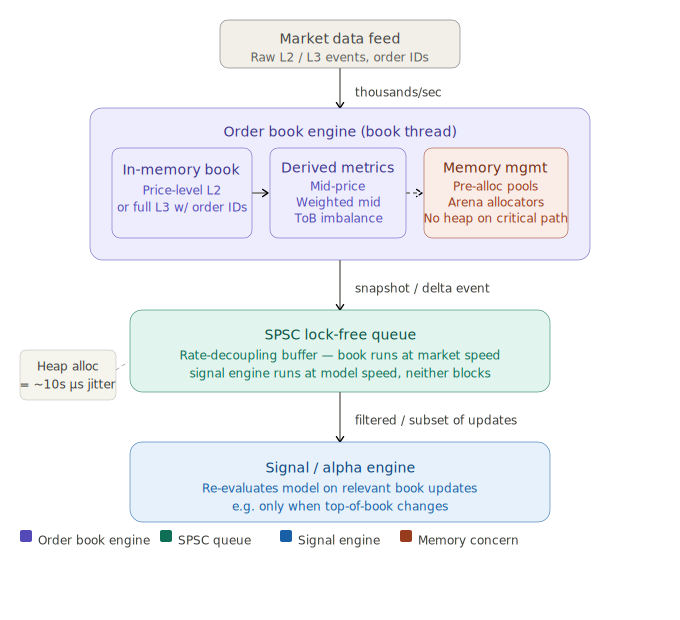

# Hight Frequency Trading Pipeline, Stage 3

> [!NOTE]
> 
> Generated by Claude.ai
>
> Model: Sonet 4.6
>
> Prompt: Based on the following description, provide an in-depth overview of Stage 3 of the High Frequency Trading pipeline. Pay close attention to the key elements of the system architecture, software development, and the business implications of this stage.
> 
> =====
> 
> ### The Full Pipeline in Detail
> 
> **Stage 3 — Order Book Engine to Signal/Alpha Engine**
> 
> The order book thread maintains a **price-level aggregated L2 or full L3 book** (tracking individual order identifiers) in memory. After processing each event, it computes derived metrics — mid-price, weighted mid, top-of-book imbalance, fill probability estimates — and writes a book snapshot or delta event to the signal engine's SPSC queue. The book thread must be extremely disciplined about memory allocation: a heap allocation during the critical path can introduce tens of microseconds of jitter from the memory allocator's internal locks. Pre-allocated object pools and arena allocators are standard.
> 
> The SPSC queue here carries a crucial architectural function beyond mere communication: it acts as a **rate-decoupling buffer**. The order book can be updated thousands of times per second during volatile market periods, but the signal engine may only need to re-evaluate its model on a subset of those updates (e.g., only when top-of-book changes). The queue allows the book thread to run at market speed while the signal thread processes at model speed, without either thread blocking the other.

# HFT Pipeline, Stage 3

Here is a detailed breakdown of Stage 3 — the bridge between raw market data and trading intelligence.

---

## System architecture

The order book engine sits at the heart of Stage 3. It maintains the market's state in memory as either a price-level aggregated L2 book (quantities per price tier) or a full L3 book (individual order identifiers tracked). After processing each market event, it computes a set of derived metrics — mid-price, weighted mid-price, top-of-book imbalance, and fill probability estimates — before publishing a snapshot or delta event downstream.

The computed output is pushed into a **Single-Producer Single-Consumer (SPSC) queue**, which is the architectural interface between the order book thread and the signal/alpha engine. This queue is lock-free by design: because there is exactly one writer and one reader, no mutex or atomic compare-and-swap contention is needed, yielding deterministic, nanosecond-scale handoffs.

---

## The order book data structure

The book thread maintains state in one of two modes. In **L2 mode**, it tracks aggregated quantities at each price level — the canonical "depth of market" view. In **L3 mode**, it goes further by tracking the identifiers of individual resting orders, allowing the engine to distinguish between, say, a single large order and many small ones at the same price level. L3 fidelity is computationally more expensive to maintain but gives the signal engine far richer raw material for modelling queue dynamics and predicting fill probability.

After each event is processed, the engine computes a set of derived statistics:

- **Mid-price**: the arithmetic mean of best bid and best ask — a basic fair-value reference.
- **Weighted mid**: a skewed mid-price that tilts toward the side with more size, reflecting where the "true" price is likely to be relative to the raw spread.
- **Top-of-book imbalance**: the ratio of bid quantity to ask quantity at the best levels, a short-horizon directional signal in its own right.
- **Fill probability estimates**: probabilistic estimates of whether a resting order will be filled before the price moves away, often informed by L3 queue position.

---

## Memory management as a performance discipline

This is where the engineering is most demanding and most counterintuitive. In a conventional application, calling `malloc` or triggering a garbage collection pause is invisible. In an HFT book thread, a single heap allocation on the critical path can introduce **tens of microseconds of latency jitter** — not because allocation is slow on average, but because the memory allocator uses internal locks, and under contention those locks can stall the thread unpredictably.

The solution is to eliminate dynamic allocation entirely from the hot path. Two patterns dominate in practice:

**Pre-allocated object pools** reserve a fixed block of memory at startup and hand out objects from a free list. Allocation becomes a pointer bump — deterministic and branchless.

**Arena allocators** go further: all memory for a given processing cycle is carved from a single large pre-reserved region, and the entire arena is reset (not individually freed) at the end of the cycle. This removes per-object bookkeeping overhead entirely.

The implication is that the book thread's data structures — order entries, price level nodes, event records — must all be designed around these constraints from day one. This is a significant software architecture commitment, not an optimisation bolt-on.

---

## The SPSC queue's dual role

The SPSC (Single-Producer Single-Consumer) queue serves two distinct functions that are easy to conflate but worth separating:

**Communication**: it is the physical transport mechanism between the book thread and the signal thread, residing in shared memory, implemented without locks because the single-writer/single-reader invariant removes the need for them.

**Rate decoupling**: this is the architecturally significant role. During volatile market periods, the order book can be updated thousands of times per second. Feeding every one of those updates directly to the signal engine would be wasteful and potentially destabilising — the signal engine needs time to run its model. Instead, the queue acts as a buffer. The book thread produces at market speed; the signal thread consumes at model speed. The queue absorbs the difference. Neither thread has to wait for the other, and neither has to slow down to match the other's pace. The signal engine can further filter by reading only updates where the top-of-book has changed, discarding interior-book updates that don't affect the model's inputs.

This rate-decoupling pattern is what allows the two stages to be independently tuned — the book engine for throughput, the signal engine for latency and model complexity.

---

## Business implications

The design choices in Stage 3 directly determine three commercially critical properties:

**Alpha freshness**: a signal engine that receives stale or jittered book snapshots is trading on outdated information. In a market where edge evaporates in microseconds, the book thread's latency discipline is what keeps the alpha signal valid by the time it reaches the order router.

**Model sophistication ceiling**: the rate-decoupling buffer grants the signal engine budget to run more complex models. If every book update required an immediate response, the engine would be forced into trivial heuristics. The queue gives it time — and time is the resource that makes machine-learned models viable in real-time.

**Operational stability**: because neither thread blocks the other, a transient spike in book update rate (a large news event, a flash crash) does not cascade into the signal engine. The queue absorbs the burst, and the signal engine catches up at its own pace. Without this decoupling, a market volatility spike could cause exactly the kind of system instability that is most costly during the moments when the firm most needs reliable execution.
