# Hight Frequency Trading Pipeline, Stage 6

> [!NOTE]
> 
> Generated by Claude.ai
>
> Model: Sonet 4.6
>
> Prompt: Based on the following description, provide an in-depth overview of Stage 6 of the High Frequency Trading pipeline. Pay close attention to the key elements of the system architecture, software development, and the business implications of this stage.
> 
> =====
> 
> ### The Full Pipeline in Detail
> 
> **Stage 6 — Gateway to OMS (Inbound Execution Reports)**
> 
> Every outbound path has a corresponding inbound path. The gateway thread receives execution reports from the exchange — fills (full or partial), cancellation confirmations, rejects — and enqueues them for the OMS to process. This is a separate SPSC queue from the outbound path, maintaining strict unidirectional data flow.
> 
> The OMS processes these reports to update the canonical state of all open orders, real-time position tracking, and P&L attribution. This state is the authoritative source of truth for whether the firm is flat, long, or short in each instrument, and by how much.

# HFT Pipeline, Stage 6

Stage 6 is the **inbound execution reporting loop** — the counterpart to every order the firm sends out. Where Stage 5 (or whichever outbound stage precedes it) pushes orders *to* the exchange, Stage 6 closes the feedback loop by receiving the exchange's responses and feeding them into the Order Management System (OMS), which maintains the firm's authoritative view of the world.

Here's the architecture at a glance:

---

## System architecture

**Strict unidirectional data flow via SPSC queues**

The central architectural decision in Stage 6 is the use of a dedicated, independent Single-Producer Single-Consumer (SPSC) queue for inbound execution reports. This queue is entirely separate from whatever SPSC queue carries outbound order messages. The reason is fundamental: mixing inbound and outbound messages on the same queue would create a bidirectional channel, introducing the possibility of ordering ambiguity, head-of-line blocking, and harder-to-reason-about state transitions in the OMS.

An SPSC queue is the canonical HFT primitive for inter-thread communication. Because exactly one thread writes to it (the gateway) and exactly one thread reads from it (the OMS thread), the implementation requires no locking at all — no mutexes, no atomics beyond a simple sequence counter. This makes it cache-friendly and deterministically fast, typically operating in the tens of nanoseconds per enqueue/dequeue cycle on modern hardware.

**The gateway thread**

The gateway thread sits at the boundary between the network and the internal pipeline. Its job in Stage 6 is narrow and deliberate: receive bytes from the exchange over the wire (typically via a kernel-bypass NIC driver like Solarflare or Mellanox using DPDK or OpenOnload), decode the exchange's binary protocol into an internal execution report struct, and call `enqueue()` on the inbound SPSC queue. It does nothing else. No business logic, no state mutation, no branching on the content of the report.

Execution reports arrive in three broad categories:

- **Fills** — a full or partial match against a resting or aggressive order. A partial fill updates the remaining open quantity; a full fill closes the order.
- **Cancellation confirmations** — the exchange acknowledges that an order has been removed from its book.
- **Rejects** — the order was never accepted; reasons include fat-finger checks, duplicate order IDs, or insufficient margin.

Each of these carries a unique order ID that allows the OMS to locate and update the correct internal order object.

**The OMS thread**

The OMS is the most stateful component in the pipeline. It dequeues execution reports and applies them as mutations to a set of data structures it owns exclusively:

- **Open order book** — a map from order ID to order state. Each state machine transitions through `new → acknowledged → partially filled → filled / cancelled / rejected`. The OMS is the only thread permitted to write to this structure.
- **Position table** — a per-instrument running net position (long or short, by quantity). Every fill increments or decrements this. The position table is what lets the risk engine and strategy know whether the firm is flat, long, or short in a given instrument at any moment.
- **P&L attribution** — fills carry a price and a quantity; the OMS multiplies these against the average entry price to compute realized P&L on each closed position and mark-to-market (unrealized) P&L on open positions.

---

## Software development considerations

**Memory layout and cache discipline**

The order state objects in the OMS open order book must be designed to fit within as few cache lines as possible. A typical 64-byte cache line can hold an entire small order record (order ID, instrument ID, side, price, original quantity, filled quantity, status). Padding and field alignment matter — misaligned structs cause the CPU to straddle two cache lines on every access, doubling memory latency.

The SPSC queue itself is usually implemented as a fixed-capacity ring buffer allocated at startup. The head and tail indices live on separate cache lines to avoid false sharing between the producer (gateway) and consumer (OMS) threads.

**Deterministic latency requirements**

The OMS processing loop must never block, allocate heap memory, or call into the OS. Any of these can introduce jitter measured in microseconds or worse. Memory for order state objects is pre-allocated in a pool at startup; the OMS borrows and returns slots from this pool, never calling `new` or `malloc` in the hot path.

**Fault handling and reject processing**

Reject handling deserves special attention. A rejected order means the firm *believes* it has a working order at the exchange but the exchange never accepted it. If the OMS fails to process the reject promptly and accurately, the firm's internal order count and position model will diverge from reality — a dangerous state. Robust implementations deduplicate rejects against pending orders and raise an alert if an unexpected order ID appears in a reject.

---

## Business implications

**The OMS as the authoritative source of truth**

Every downstream consumer — the risk engine, the strategy signal engine, the P&L dashboard, regulatory reporting — derives its view of the world from OMS state. This makes the correctness and freshness of OMS data a first-order business concern. A stale position table means the strategy may send orders that inadvertently exceed position limits. A missed fill means the strategy thinks it still has a working order and may attempt to re-submit, creating a duplicate.

**P&L attribution and performance measurement**

Real-time P&L tracking driven by execution reports is what allows the firm to evaluate strategy performance intraday. Traders and risk managers can observe whether a strategy is hitting its theoretical edge or leaking alpha through adverse fills (slippage between the expected fill price and the actual fill price). This feedback loop informs decisions about strategy parameters, quote aggressiveness, and risk limits.

**Regulatory obligations**

Execution reports are the raw material for trade reporting mandated by regulators (MiFID II, SEC Rule 17a-4, CAT in the US, etc.). Every fill must be time-stamped with exchange-reported timestamps, linked to the originating order, and stored durably. Stage 6 is where that data enters the firm's systems; any loss or corruption here creates compliance exposure. In practice, a separate logging thread typically shadows the OMS, consuming execution reports from a second queue (or reading OMS-published state) purely for audit purposes.

**Latency symmetry with the outbound path**

There is an implicit business requirement that inbound latency be as low as outbound latency. A firm that can send an order in 1 µs but takes 50 µs to process the fill confirmation is operating blind for 49 µs after each trade — long enough for the market to move materially against the position. The separation of inbound and outbound queues, and the dedicated OMS thread, ensures the two paths do not compete for CPU time or cache resources.
