# Hight Frequency Trading Pipeline, Stage 7

> [!NOTE]
> 
> Generated by Claude.ai
>
> Model: Sonet 4.6
>
> Prompt: Based on the following description, provide an in-depth overview of Stage 7 of the High Frequency Trading pipeline. Pay close attention to the key elements of the system architecture, software development, and the business implications of this stage.
> 
> =====
> 
> ### The Full Pipeline in Detail
> 
> **Stage 7 — OMS to Risk Manager**
> 
> Every order event processed by the OMS is simultaneously shadowed to a dedicated risk thread via another SPSC queue. The risk thread independently maintains position, Greeks, gross/net exposure, and concentration limits. This is architected as an **intentionally one-way, best-effort channel**: if the risk queue fills up because the risk thread falls behind, the OMS must not block — it simply drops the shadow event and logs the condition. The risk thread catching up slightly behind real-time is acceptable; the OMS stalling is not.

# HFT Pipeline, Stage 7

Here is a comprehensive breakdown of Stage 7 of the HFT pipeline.

---

## Overview

Stage 7 describes the architectural bridge between the Order Management System (OMS) and the Risk Manager. It is not a simple data relay — it is a carefully designed, asymmetric relationship where the OMS remains the system of record and absolute priority, and the Risk Manager is a downstream observer that must never be allowed to exert back-pressure on trading operations.

---

## System Architecture

### The SPSC Queue as the Transport Layer

The channel between the OMS and the Risk thread is a **Single-Producer, Single-Consumer (SPSC) queue**. This is a deliberate choice rooted in mechanical simplicity and performance. Because only one thread writes (the OMS) and only one thread reads (the Risk thread), the queue requires no locking, no atomic compare-and-swap loops for multi-producer contention, and no coordination overhead. In a system where nanoseconds matter, this is the only acceptable design.

The use of "another" SPSC queue is significant — it signals that Stage 7 is one of several parallel shadow channels emanating from the OMS, each serving a different downstream consumer without any of them interfering with one another.

### The One-Way, Best-Effort Contract

The most architecturally consequential decision in Stage 7 is that the channel is **intentionally one-way and best-effort**. This language is precise and load-bearing:

**One-way** means the Risk thread cannot issue commands, rejections, or signals back to the OMS through this channel. If risk limits are breached, that information must travel through a separate, out-of-band mechanism — not back-pressure on this queue. The OMS is never a consumer here; it only produces.

**Best-effort** means delivery is not guaranteed. If the Risk thread falls behind and the queue fills, shadow events are **dropped silently** (with a log entry). This is not a bug — it is a specification. The system is explicitly designed to prefer losing risk observability over stalling order flow.

This inverts the typical enterprise assumption that risk controls are gates. Here, risk is a monitor, not a guardian.

### The Drop-and-Log Discipline

When the queue is full, the OMS drops the shadow event and logs the condition. This logging is critical infrastructure, not an afterthought. It creates an audit trail that allows post-hoc reconstruction of what the risk thread missed, enables monitoring systems to raise alarms if the drop rate climbs above acceptable thresholds, and gives engineers diagnostic data to tune queue depth and risk thread latency. The log entry is the safety valve of the safety valve.

---

---

## Risk Thread Internals

### What the Risk Thread Maintains

The risk thread independently tracks several categories of state, each with a distinct purpose:

**Positions** are the net quantity of each instrument held. These update on every fill and cancellation shadow event. They are the foundation everything else is derived from.

**Greeks** are the sensitivities of a derivatives portfolio to market variables — delta (directional exposure), gamma (rate of change of delta), vega (volatility sensitivity), theta (time decay), and rho (rate sensitivity). These require both position data and current market prices, which means the risk thread likely also consumes a market data feed independently of the OMS shadow channel.

**Gross and net exposure** represent the total absolute value of positions (gross) versus the long-minus-short sum (net). Regulators and internal risk policies typically impose limits on both, since a large gross book can carry hidden correlation risk even when net exposure appears flat.

**Concentration limits** cap the proportion of any single instrument, sector, or counterparty in the overall portfolio, preventing the system from accidentally building a dangerously correlated position.

The word "independently" in the description is important. The risk thread does not delegate, query, or wait on the OMS to answer questions about portfolio state. It maintains its own replica. This means it can compute and enforce limits without introducing any latency into the critical path.

---

## Software Design Implications

### Threading Model

Stage 7 implies a strict thread affinity model. The OMS runs on its own pinned core. The risk thread runs on a separate pinned core. The SPSC queue is the only communication surface between them. There are no mutexes, no condition variables, and no shared mutable state aside from the queue itself. The risk thread never writes back through the queue.

### Queue Depth Tuning

The bounded queue's depth is a tunable parameter with real performance consequences. A deeper queue absorbs risk-thread latency spikes (garbage collection pauses, cache misses, heavy Greeks recalculation) without triggering drops. But a deeper queue also delays the moment the OMS detects that the risk thread is falling behind — the log event arrives later. Operators tune this depth based on observed risk thread p99 latencies under peak load.

### Monitoring the Drop Rate

The drop-and-log mechanism creates a natural health metric: the shadow drop rate. Under normal conditions it should be near zero. A sustained non-zero drop rate signals that the risk thread is chronically unable to keep pace, which may indicate a performance regression, a sudden market volatility spike increasing event volume, or a bug introducing unnecessary work inside the risk loop. Alerting on this metric is essential operational hygiene.

---

## Business Implications

### Latency vs. Safety: A Deliberate Tradeoff

Stage 7 enshrines a specific philosophy about the relationship between trading latency and risk oversight. The OMS is treated as inviolably latency-sensitive. The risk thread is treated as latency-tolerant. This is appropriate for a system where order execution speed directly determines P&L (for example, in market-making or statistical arbitrage), and where the consequence of a slightly stale risk snapshot is bounded and manageable.

However, this design would be inappropriate for a system where a single large erroneous order could cause catastrophic loss — for instance, a system running large block trades in illiquid markets. In those contexts, risk must be synchronous, not shadowed.

### Regulatory Considerations

Regulators such as the SEC (in the US) and ESMA (in Europe) require that HFT firms maintain pre-trade risk controls. A shadow risk channel that can drop events is arguably a post-trade observability tool, not a pre-trade control. Firms operating this architecture must ensure that actual pre-trade limits are enforced elsewhere in the pipeline — likely in the OMS itself or in a dedicated pre-trade risk gate that sits in the critical path. Stage 7's risk thread is a monitoring and alerting layer, not the firm's primary compliance mechanism.

### Operational Discipline

The intentional acceptance of lag introduces an operational discipline requirement: engineers and risk managers must understand the maximum possible staleness of the risk snapshot and factor that into any manual intervention decisions. If the risk thread is 50ms behind and a trader queries its output to make a hedging decision, they are looking at a world that may no longer exist. This is not a flaw, but it must be documented and understood across all teams relying on the risk thread's output.

---

In summary, Stage 7 is a study in deliberate asymmetry — maximum protection for the latency-critical OMS, maximum information density for the risk observer, and a clear-eyed acceptance that in HFT, the cost of stopping is almost always higher than the cost of watching imperfectly.
